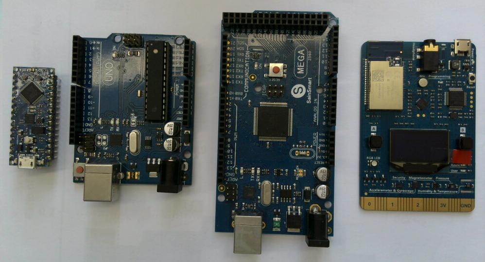
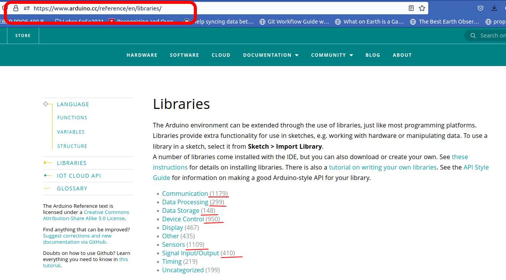
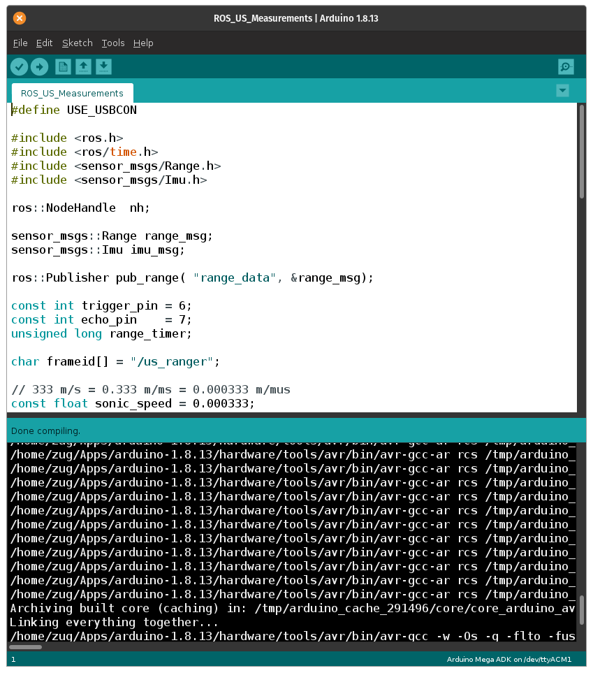
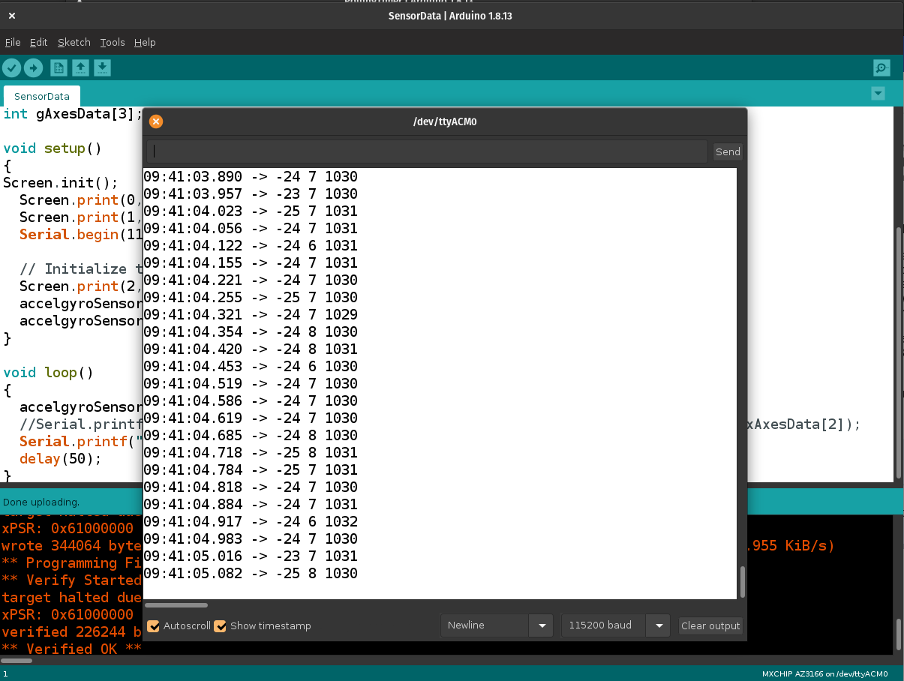

<!--

author:   Sebastian Zug & André Dietrich & Galina Rudolf
email:    sebastian.zug@informatik.tu-freiberg.de & andre.dietrich@ovgu.de & Galina.Rudolf@informatik.tu-freiberg.de
version:  1.0.5
language: de
narrator: Deutsch Female

comment: Einführung in die Programmierung für Nicht-Informatiker
logo: ./img/LogoCodeExample.png

import: https://github.com/liascript/CodeRunner
        https://github.com/LiaTemplates/AVR8js/main/README.md#10
        https://raw.githubusercontent.com/liascript-templates/plantUML/master/README.md
        https://raw.githubusercontent.com/liaTemplates/PyScript/main/README.md

-->

[](https://liascript.github.io/course/?https://github.com/TUBAF-IfI-LiaScript/VL_ProzeduraleProgrammierung/blob/master/11_Microcontroller.md)

# Softwareentwicklung für Microcontroller

| Parameter                | Kursinformationen                                                                                                                                                                              |
|--------------------------|------------------------------------------------------------------------------------------------------------------------------------------------------------------------------------------------|
| **Veranstaltung:**       | `Prozedurale Programmierung / Einführung in die Informatik`                                                                                                                                    |
| **Semester**             | `Wintersemester 2022/23`                                                                                                                                                                       |
| **Hochschule:**          | `Technische Universität Freiberg`                                                                                                                                                              |
| **Inhalte:**             | `Anwendung von C++ auf bei der  Mikrocontrollerprogrammierung`                                                                                                                                                    |
| **Link auf Repository:** | [https://github.com/TUBAF-IfI-LiaScript/VL_ProzeduraleProgrammierung/blob/master/11_Arduino.md](https://github.com/TUBAF-IfI-LiaScript/VL_ProzeduraleProgrammierung/blob/master/11_Arduino.md) |
| **Autoren**              | @author                                                                                                                                                                                        |


--------------------------------------------------------------------


**Fragen an die heutige Veranstaltung ...**

* Unterscheiden Sie zwischen der "erstmaligen Belegung" mittels Initialisierungsliste und Zuweisungen im Konstruktor!
* In welchem Speicherbereich werden die dynamisch erzeugten Objekte angelegt?
* Was unterscheidet die Verwendung von Variablen auf dem Stack und dem Heap?
* Warum braucht man ohnehin dynamische Objekte?

---------------------------------------------------------------------

## Microcontroller als Datensammler

<!--
style="width: 80%; min-width: 420px; max-width: 720px;"
-->
```ascii 
                            Datenlogger
                            +------------------------------------------------+
                            |                               Speicher         |
                       +    |         +-----------+      +--------------+    |
       Umgebung-       |\   | Sensor- | Controll- |      | ...          |\   |         
       phänomene       | +--|-------->| Software  |--+-->| 12:30 Temp 12+-+  |
                       |/   | signale |           |  |   | 12:40 Temp 13  |  |
                       +    |         +-----------+  |   +----------------+  |
                            |                        +-----------------------|---> Datenserver
                            +------------------------------------------------+
```

> Ein Datenlogger ist eine prozessorgesteuerte Speichereinheit, welche Daten in einem bestimmten Rhythmus über eine Schnittstelle aufnimmt und auf einem Speichermedium ablegt. Dafür integriert die Datenloggerhardware Sensoren, Speicher und einen eingebetteten Rechner.

- Welches Umgebungsphänomen/e sollen erfasst werden?
- Wie lässt sich ein entsprechender Sensor mit dem Controller verknüpfen?
- Welche Qualität ist bei der Erfassung notwendig?
- Soll die Messdatenaufnahme periodisch oder eventgetrieben erfolgen?
- Wie lang ist der intendierte Messzeitraum - reichen Datenspeicher und Batteriekapazität?
- Braucht unser Logger ein Display oder eine andere Möglichkeit um seinen Zustand anzuzeigen?

### Sensoren / Aktoren

> Ein Sensor (von lateinisch _sentire_, „fühlen“ oder „empfinden“), auch als Detektor, (Messgrößen- oder Mess-)Aufnehmer oder (Mess-)Fühler bezeichnet, ist ein technisches Bauteil, das Umgebungsparameter als Messgröße quantitativ erfassen kann. Dabei werden physikalische Eigenschaften wie Temperatur, Feuchtigkeit, Druck, Helligkeit, Beschleunigung oder chemische z. B. pH-Wert, elektrochemisches Potential usw. als weiterverarbeitbares elektrisches Signal bereitgestellt.

__Klassifikation von Sensoren__

+ intern/extern ... bezogen auf den Messgegenstand (Radencoder vs. Kamera)
+ aktiv/passiv () ... mit und ohne Beeinflussung der Umgebung (Ultraschall vs. Kamera)
+ Ergebnisdimension ... 1, 2, 2.5, 3D
+ Modalitäten ... physikalische Messgröße

<!--
style="width: 80%; max-width: 1024px; display: block; margin-left: auto; margin-right: auto;"
-->
```ascii

                Sensoren
                   |
      +------------+--------------+
      |                           |
 interne Sensoren         externe Sensoren
                                  |
               +------------------+----------+
               |                             |
            taktil                     berührungslos
                                             |
                          +------------+-----+-------+---------+
                          |            |             |         |
                      akustisch     optisch     bildbasiert   ....          
```


__Beispiel: Ultraschallsensor__

... Was war das noch mal, "Schallgeschwindigkeit"

<!-- width="50%" -->

[^Wiora]: By Georg Wiora (Dr. Schorsch) - Self drawn with Inkscape, CC BY-SA 3.0, https://commons.wikimedia.org/w/index.php?curid=353385

> Erkenntnis 1: Wir messen unter Umständen die eigentliche Messgröße nicht direkt.

Für eine gleichförmige Bewegung können wir den Weg als Produkt aus dem Messintervall und der halben Laufzeit abbilden.

$$s = v \cdot \frac{t}{2}$$

> Erkenntnis 2: Die Genauigkeit dieses Sensors wird über die Zeitauflösung des Mikrocontrollers definiert.

Leider gibt es ein Problem, die Schallgeschwindigkeit in Luft ist nicht konstant ist. Sie ist eine Funktion der Dichte $\rho$ und des (adiabatischen) Kompressionsmoduls $K$ und hängt damit vom Standort, der Temperatur usw. ab. Annäherungsweise gilt

$$v (m/s) = 331.3 + (0.606 × t) $$

Versuchen wir eine kleine Fehlerabschätzung, wenn wir den Temperatureinfluss ignorieren.

``` python @PyScript.repl
def calcUSspeed(T):
  return 331.3 + (0.606 * T)

print(calcUSspeed(25) / calcUSspeed(0))
```

> Erkenntnis 3: Abhängigkeiten beeinflussen den Messprozess

### Programmiervorgang

Der Programmiervorgang für einen Mikrocontroller unterscheidet sich in einem Punkt signifikant von Ihren bisherigen C/C++ Aufgaben - die erstellten Programme sind auf dem Entwicklungssystem nicht ausführbar. Wir tauschen also den Compiler mit der Hardware aus. Dadurch "versteht" der Entwicklungsrechner die Anweisungen aber auch nicht.

```text @plantUML
@startuml
ditaa

+-----------------------------------------------------------------------------------------+
:  C/C++ Programmierung                        Assemblerprogrammierung                    |
|  +---------------+     +---------------+     +---------------+                          |            
|  |c88F C/C++{o}  |---> |c8F8 arm-gcc   |---> |c88F *.asm{o}  |                          |            
|  +---------------+     +---------------+     +---------------+                          |           
|                                                      |                                  |
|                         Spezifischer                 v                                  |
|                         Compiler             +---------------+                          |         
|                                              |c8F8 avr-as    |                          |         
|                                              +---------------+                          |         
|                                                      |                                  |
|                                                      v                                  |
|                                              +---------------+                          |         
|                                              |      *.o{o}   |                          |         
|                                              +---------------+                          |         
|                                                      |                                  |
|                                                      v                                  |
|             +---------------+                +---------------+      +---------------+   |                                
|             |c8F8 objcopy   |<-------+       |c8F8 avr-ld    | <----|    Library{o} |   |                                
|             +---------------+        |       +---------------+      +---------------+   |                                
|                      |               |               |                                  |
|         +------------+-----------+   +---------------+                                  |
|         |                        |                   |                                  |                
|         v                        v                   v                                  |
|  +---------------+       +---------------+   +---------------+                          |         
|  |      *.hex{o} |  ...  |    *.bin{o}   |   |    *.elf{o}   |                          |         
|  +---------------+       +---------------+   +---------------+                          |  
|         |                        |                   |                                  |
|         +------------------------+-------------------+                                  |
|                                  |                                                      |
|                                  v                                                      |
|                          +---------------+                                              |
|                          |c8F8 Programmer|                                              |
|                          +---------------+                                              |     
+-----------------------------------------------------------------------------------------+
                                   |
                                   +-------------------------+  
                                   |                         |
                                   v                         v        
+-----------------------------------------------------------------------------------------+
: +---------------+        +---------------+         +---------------+                    |
| |c2F8 SRAM      |<------ |c2F8 Flash     |         |c2F8 EEPROM    |                    |
| +---------------+        +---------------+         +---------------+                    |    
| Mikrocontroller                                                                         |
+-----------------------------------------------------------------------------------------+
@enduml
```

Dabei zeigt sich aber auch der Vorteil der Hochsprachen C und C++, die grundsätzlichen Sprachinhalte sind prozessorunabhängig!

### Besonderheiten

> Standardbibliothek nicht vollständig umgesetzt 


## Arduino Konzept

Das Arduino-Projekt wurde am _Interaction Design Institute Ivrea_ (IDII) in Ivrea, Italien, ins Leben gerufen. Ausgangspunkt war die Suche nach einem preiswerten, einfach zu handhabenen Mikrocontroller der insbesondere für die Ausbildung von Nicht-Informatikern geeignet ist. Das anfängliche Arduino-Kernteam bestand aus Massimo Banzi, David Cuartielles, Tom Igoe, Gianluca Martino und David Mellis.

Nach der Fertigstellung der Plattform wurden leichtere und preiswertere Versionen in der Open-Source-Community verbreitet. Mitte 2011 wurde geschätzt, dass über 300.000 offizielle Arduinos kommerziell produziert worden waren, zwischenzeitlich wurden mehrere Millionen produziert.

### Hardware

Das Arduino Projekt hat eine Vielzahl von unterschiedlichen Boards hervorgebracht, die eine unterschiedliche Leistungsfähigkeit und Ausstattung kennzeichnen.
Das Spektrum reicht von einfachen 8-Bit Controllern bis hin zu leistungsstarken ARM Controllern, die ein eingebettetes Linux ausführen.

> **Merke:** Es gibt nicht **den** Arduino Controller, sondern eine Vielzahl von verschiedenen Boards.

<!-- style="width: 75%; max-width: 1000px" -->

Unser Controller, ein 32 Bit System, auf den im nachfolgenden eingegangen wird, liegt im mittleren Segment der Leistungsfähigkeit.

Erweitert werden die Boards durch zusätzliche `Shields`, die den Funktionsumfang erweitern.

### Programmierung 

Jedes Arduino-Programm umfasst zwei zentrale Funktionen - `setup` und `loop`. Erstgenannte wird einmalig ausgeführt und dient der Konfiguration, die zweite wird kontinuierlich umgesetzt.

<div>
  <wokwi-led color="red" pin="13" port="B" label="13"></wokwi-led>
  <span id="simulation-time"></span>
</div>
```cpp       HelloWorld.cpp
# define LED_PIN 13                 // Pin number attached to LED.
//const int led_pin_red = 13;

void setup() {
    pinMode(LED_PIN, OUTPUT);       // Configure pin 13 to be a digital output.
}

void loop() {
    digitalWrite(LED_PIN, HIGH);    // Turn on the LED.
    delay(1000);                    // Wait 1 second (1000 milliseconds).
    digitalWrite(LED_PIN, LOW);     // Turn off the LED.
    delay(1000);                    // Wait 1 second.
}
```
@AVR8js.sketch


| Befehl                        | Bedeutung                                                                                |
|-------------------------------|------------------------------------------------------------------------------------------|
| `pinMode(pin_id, direction)`  | Festlegung der Konfiguration eines Pins als Input / Output (`INPUT`, `OUTPUT`)           |
| `digitalWrite(pin_id, state)` | Schreiben eines Pins, daraufhin liegen entweder (ungefähr) 3.3 V `HIGH` oder 0V `LOW` an |

Eine Allgemeine Übersicht zu den Arduinobefehlen finden Sie unter folgendem [Link](https://www.arduino.cc/reference/en/).

### Bibliotheken

Darüber hinaus existiert eine Vielzahl von Bibliotheken, die die Arbeit mit verschiedenen Sensoren/Aktoren vereinfachen und bei der Entwicklung von Anwendungslogik unterstützen.  

<!-- style="width: 75%; max-width: 1000px" -->

### Entwicklungsumgebung

Die Entwicklungsumgebung fasst grundsätzliche Entwicklungswerkzeuge zusammen und richtet sich an Einsteiger.

<!-- style="width: 75%; max-width: 1000px" -->

> Wir verwenden die Visual Studio Code Umgebung für die Entwicklung von Mikrocontroller Code.

### Wo ist unser main()?

> Oha, wo ist denn unsere `main()` Methode geblieben? Diese sollte doch zwingender Bestandteil eines jeden C++ Programmes sein?

<div>
  <wokwi-led color="red" pin="13" port="B" label="13"></wokwi-led>
  <span id="simulation-time"></span>
</div>
```cpp       HelloWorld.cpp
# define LED_PIN 13                 // Pin number attached to LED.

int main() {
    // Das ist unser Setup-Bereich
    init();   // Aufruf einer 
    pinMode(LED_PIN, OUTPUT);     

    // Endlosschleife als Entsprechung für Loop
    while(true){
      digitalWrite(LED_PIN, HIGH); 
      delay(1000);                 
      digitalWrite(LED_PIN, LOW);  
      delay(1000);                 
    }
}
```
@AVR8js.sketch

## Exkurs: Serielle Schnittstelle

Die serielle Schnittstelle ist eine umgangssprachliche Bezeichnung für eine Übertragungsmechanismus zur Datenübertragung zwischen zwei Geräten, bei denen einzelne Bits zeitlich nacheinander ausgetauscht werden. Die Bezeichnung bezieht sich in der umgangsprachlichen Verwendung:

+ das Wirkprinzip generell, das dann verschiedenste Kommunikationsprotokoll meinen kann (CAN, I2C, usw.) oder
+ die als EIA-RS-232 bezeichnete Schnittstellendefinition.

Für Mikrocontroller werden die zugehörigen Bauteile als _Universal Asynchronous Receiver Transmitter_ (UART) bezeichnet.

Mögliche Anwendungen des UART:

+ Debug-Schnittstelle
+ Mensch-Maschine Schnittstelle - Konfiguration eines Parameters, Statusabfragen
+ Übertragen von gespeicherten Werten für ein Langzeit-Logging von Daten
+ Anschluss von Geräten - Sensoren, GNSS-Empfängern, Funkmodems
+ Implementierung von "Feldbusse" auf RS485/RS422-Basis

### Schreiben 

Für das Schreiben auf der Seriellen Schnittstelle stehen in der Arduino Welt drei Funktionen bereit `println`, `print` und `write`. Diese können mit zusätzlichen Parametern versehen werden, um eine eingeschränkte Formatierung vorzunehmen.

```cpp       UARTWrite.cpp
void setup() {
  Serial.begin(9600);
  Serial.println("Los geht's!");
  Serial.println(5);
  Serial.println(5, BIN);
  Serial.println(5.34543, 2);
  Serial.println("Fertig!");
}

void loop() {
}
```
@AVR8js.sketch

### Lesen  

Die Umkehr der Kommunikationsrichtung ermöglicht es, Daten an den Mikrocontroller zu senden und damit bestimmte Einstellungen vorzunehmen.

<div>
  <wokwi-led color="red" pin="13" port="B" label="13"></wokwi-led>
  <span id="simulation-time"></span>
</div>
```cpp       ControlLED.cpp
int incomingByte = 0; // for incoming serial data

void setup() {
  Serial.begin(9600);
  pinMode(13, OUTPUT);   // LED Pin als Output
}

void loop() {
  // any data received?
  if (Serial.available() > 0) {
    // read the incoming byte:
    incomingByte = Serial.read();

    // say what you got:
    Serial.print("I received: ");
    Serial.println(incomingByte, DEC);
  }
}
```
@AVR8js.sketch

> **Aufgabe:** Schalten Sie die LED die mit Pin 13 Verbunden ist mit einem `A` an und mit einem `B` aus. Dabei soll die LED mindestens 3s angeschaltet bleiben.

> **Aufgabe:** Erweitern Sie das Programm, so dass mit 'AN' und 'AUS' die Aktivierung umgesetzt werden kann. Gehen Sie davon aus, dass der Nutzer auch kleine Buchstaben verwenden kann. (Hilfen [String Klasse](https://www.arduino.cc/reference/de/language/variables/data-types/stringobject/), [Arduino Reference](https://arduinogetstarted.com/de/reference/serial-readstringuntil))

## Seriellen Daten in der Arduino IDE

Der in der Arduino IDE eingebettete Serial Monitor ist eine Möglichkeit die über die Serielle Schnittstelle empfangenen Daten auszulesen. Mit der richtigen Konfiguration von

+ USB Port (in der Entwicklungsumgebung selbst) und
+ Baudrate (im unteren Teil des Monitors)

werden die Texte sichtbar. Sie können die Informationen speichern, indem Sie diese Markieren und in eine Datei kopieren. Sofern Sie auf eine gleiche Zahl von Einträgen pro Zeile achten, können die Daten dann als [csv](https://de.wikipedia.org/wiki/CSV_(Dateiformat)) (_Comma-separated values_) Datei zum Beispiel mit Tabellenkalkulationsprogrammen geöffnet werden.

<!--
style=" width: 80%;
        max-width: 600px;
        min-width: 400px;
        display: block;
        margin-left: auto;
        margin-right: auto;"
-->

> **Merke:** Die Einblendung des Zeitstempels garantiert die Zuordenbarkeit der kommunizierten Daten. Der Zeitstempel wird dabei vom Entwicklungsrechner generiert.

Die Eingabe von Daten, die an den erfolgt in der Zeile unter dem Ausgabefeld. Erst mit dem Betätigen von Enter, werden die Daten tatsächlich übertragen.

Der Plotter ermöglicht die unmittelbare grafische Darstellung der Daten, die über die serielle Schnittstelle ausgetauscht werden.

Ein Datensatz besteht aus einer einzelnen Zeile, die durch einen Zeilenumbruch (`\n` oder `Serial.println`) begrenzt wird.

Neben dem einfachen plotten von Zahlen können diese auch beschriftet werden. Beschriftungen können entweder einmalig im Setup gesetzt werden ODER sie können mit jeder Zeile übergeben werden.

```
Sensor1:30, Sensor2:45\n.
```

<!--
style=" width: 80%;
        max-width: 600px;
        min-width: 400px;
        display: block;
        margin-left: auto;
        margin-right: auto;"
-->

Anmerkungen:

1. Unser Board generiert automatisch eine Ausgabe zur Version, Hersteller usw., die den Plotter "irritiert". Entsprechend zeigte sich die Darstellung der Legende in der zeilenbasierten Darstellung als stabiler.
2. Wenn Sie die zeilenbasierten Beschriftungen verwenden, fügen Sie kein Leerzeichen nach dem ":" ein!

> **Merke:** Die Serielle Schnittstelle kann aus allen Programmiersprachen heraus genutzt werden. Sie können also in C, C++, Python usw. eigene Programme für das Auslesen und die Interpretation der Daten schreiben.


## Unser Controller

<!-- data-type="none" -->
| Kategorie  | Features laut Webseite                  | Bedeutung                                                |
|------------|-----------------------------------------|----------------------------------------------------------|
| Controller | _EMW3166 Wifi module_                   | Eingebetteter Controller mit WLAN Schnittstelle          |
| Peripherie | _Audio codec chip_                      | Hardware Audioverarbeitungseinheit                       |
|            | _Security encryption chip_              | Verschlüsselungsfeatures in einem separaten Controller   |
|            | _2 user button_                         |                                                          |
| Aktoren    | _1 RGB light_                           |                                                          |
|            | _3 working status indicator_            | _WiFi_, _Azure_, _User_ Leds auf der rechten Seite       |
|            | _Infrared emitter_                      | Infrarot Sender für die Nutzung als Fernbedienung        |
|            | _OLED,128×64_                           | Display mit einer Auflösung von 128 x 64 Pixeln          |
| Sensoren   | _Motion sensor_                         | Interialmessystem aus Beschleunigungssensor und Gyroskop |
|            | _Magnetometer sensor_                   |                                                          |
|            | _Atmospheric pressure sensor_           |                                                          |
|            | _Temperature and humidity sensor_       |                                                          |
|            | _Microphone_                            |                                                          |
| Anschlüsse | _Connecting finger extension interface_ |                                                          |

<!-- style="width: 55%; max-width: 1000px" -->[^3]

[^3]: Produktwebseite Firma MXChip, AZ3166 Procuct Details [Link](https://en.mxchip.com/az3166)

Worin unterscheidet sich der Controller von einem willkürlich ausgewählten Laptop?

<!-- data-type="none" -->
| Parameter        | AZ3166                            | Laptop                           |
|------------------|-----------------------------------|----------------------------------|
| Bandbreite       | 32Bit                             | 64Bit                            |
| Taktrate         | 100Mhz                            | 3.5Ghz                           |
| Arbeitsspeicher  | 256kBytes                         | 8 GBytes                         |
| Programmspeicher | 1 MByte                           |                                  |
| Energieaufnahme  | 0.x Watt                          | 100 Watt                         |
| Kosten           | $40$ Euro                         | $>500$ Euro                      |
| Einsatz          | Spezifisches eingebettetes System | Vielfältige Einsatzmöglichkeiten |

Zum Vergleich, eine Schreibmaschinenseite umfasst etwa 2KBytes.

Die Dokumentation der zugehörige _Application Programming Interface_ (API) finden Sie unter [Link](https://microsoft.github.io/azure-iot-developer-kit/docs/apis/led/).
Hier stehen Klassen bereit, die Einbettung der Sensoren, LEDs, des Displays kapseln und die Verwendung vereinfachen.

## Anwendungsfall

Bestimmen Sie die Periodendauer eines Fadenpendels bzw. die Erdbeschleunigung bei einer bekannten Fadenlänge!

$$
T_0= 2\pi\sqrt{\frac{l}{g}}
$$

> **Frage:** Welche Sensoren können wir dafür nutzen?

<iframe width="560" height="315" src="https://www.youtube.com/embed/q3_m1JW1ttQ" frameborder="0" allow="accelerometer; autoplay; clipboard-write; encrypted-media; gyroscope; picture-in-picture" allowfullscreen></iframe>

Unser Ansatz unterscheidet sich davon, wir nutzen den Magnetkompass unseres Boards, der auf die Präsenz von magnetoresistiven Materialien in der Umgebung reagiert [Link](https://microsoft.github.io/azure-iot-developer-kit/docs/apis/lis2mdl/#init).

Der Sensor ist über den I2C Bus an unser Board angeknüpft. Dieser überträgt die Messdaten serialisiert an den Controller. Wir müssen also, um die Daten nutzen zu können sowohl eine Instanz der Sensorklasse `LIS2MDLSensor` als auch eine Instanz der Busklasse `DevI2C` erzeugen. Dem Sensor wird dabei das erzeugte Busobjekt im Konstruktor übergeben.

```cpp   ReadingMagdnetometerValues.ino
#include "LIS2MDLSensor.h"

DevI2C ext_i2c(D14,D15);
LIS2MDLSensor lis2mdl(ext_i2c);

int axes[3];

void setup(){
    lis2mdl.init(NULL);
    Serial.begin(115200);
}

void loop(){
    lis2mdl.getMAxes(axes);
    Serial.printf("%d, %d, %d\n", axes[0], axes[1], axes[2]);
    delay(10);
}
```

Bringen wir einen magnetorresistives Objekt in die Nähe des Sensors, so kann er dessen Auswirkung auf das Magnetfeld der Erde messen.

<!-- style="width: 55%; max-width: 1000px" -->

Für unser Pendel sieht der Verlauf dann entsprechend wie folgt aus:

<!-- style="width: 55%; max-width: 1000px" -->

Eine Lösung für die Extraktion der Periodendauer finden Sie in unserem Vorlesungsverzeichnis [Link](https://github.com/SebastianZug/VL_ProzeduraleProgrammierung/blob/master/examples/11_Arduino/MagnetometerPendel/MagnetometerPendel.ino). Gelingt es Ihnen eine bessere Lösung zu entwickeln?


``` python @PyScript.env
- matplotlib
- numpy
```

``` python @PyScript.repl
import numpy as np
import matplotlib.pyplot as plt

periods = np.array([1524, 1541, 1541, 1541, 1541, 1541, 1531, 1541, 1541, 1541, 1541, 1537, 1531, 1541, 1541, 1541, 1541, 1531, 1530, 1530, 1541, 1541, 1542, 1537, 1531, 1541, 1541, 1531, 1541, 1531, 1541, 1531, 1541, 1531, 1542, 1531, 1542, 1541, 1531, 1537, 1531, 1542, 1531, 1541, 1531, 1531, 1542, 1541, 1531, 1541, 1531, 1531, 1531, 1531, 1531, 1541, 1535, 1531, 1541, 1531, 1545, 1541, 1541, 1541, 1541, 1541, 1541, 1541, 1541, 1537, 1541, 1541, 1541, 1531, 1541, 1542, 1541, 1541, 1541, 1541, 1531, 1542, 1541, 1541, 1541, 1541, 1531, 1541, 1541, 1542, 1541, 1541, 1542, 1531, 1541, 1541, 1531, 1538, 1530, 1531, 1530, 1541, 1530, 1541, 1534, 1541, 1531, 1531, 1541, 1541, 1530, 1541, 1531, 1542, 1531, 1541, 1531, 1534, 1541, 1531, 1541, 1534, 1541, 1542, 1531, 1541, 1531, 1541, 1541, 1541, 1541, 1531, 1531, 1530, 1541, 1531, 1530, 1532, 1531, 1541, 1541, 1541, 1534, 1545, 1541, 1531, 1531, 1541, 1542, 1541, 1534, 1530, 1542, 1531, 1531, 1542, 1531, 1541, 1541, 1530, 1535, 1541, 1541])

periods = periods / 1000  # ms -> s
length = (periods / ( 2 * np.pi))**2 * 9.81  # vgl. Gleichung Fadenpendel

fig, ax = plt.subplots()
ax.hist(length)
plt.title("Gaussian Histogram")
plt.xlabel("Periodendauer in ms")
plt.ylabel("Häufigkeit")

fig  # notwendig für die Ausgabe in LiaScript sonst plt.show()
```