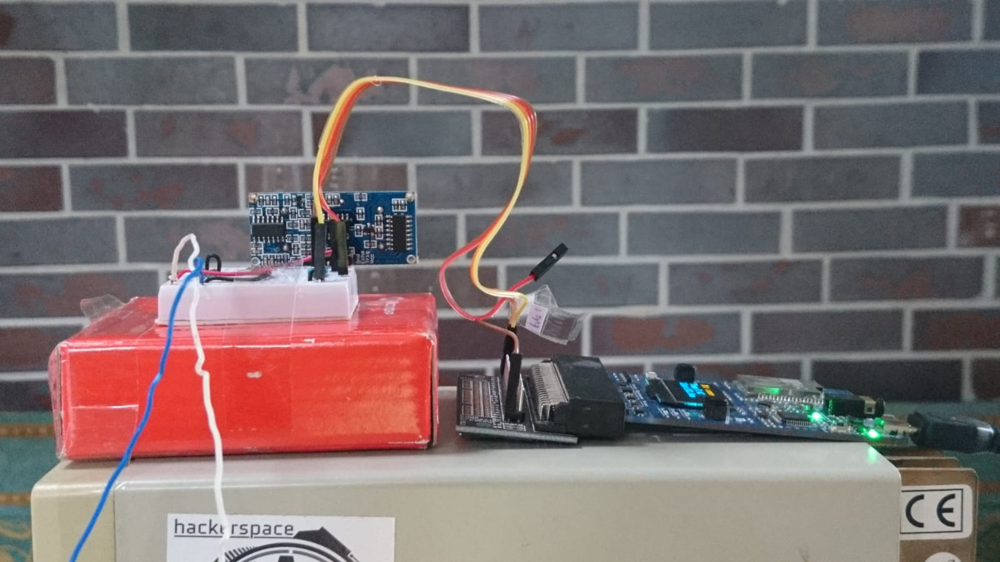
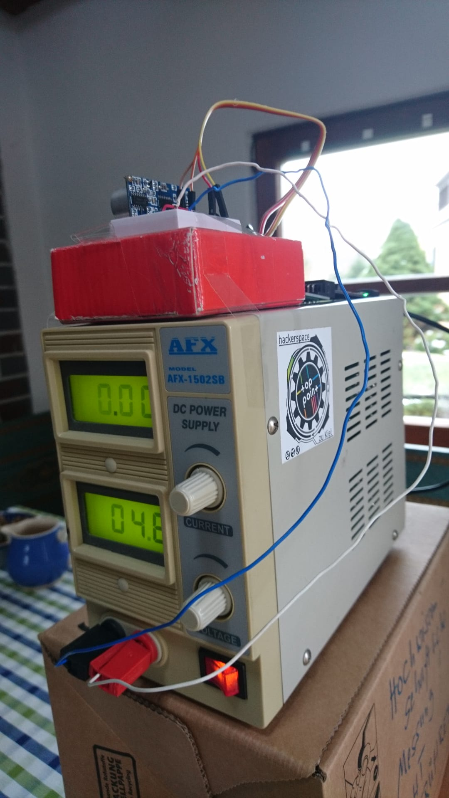
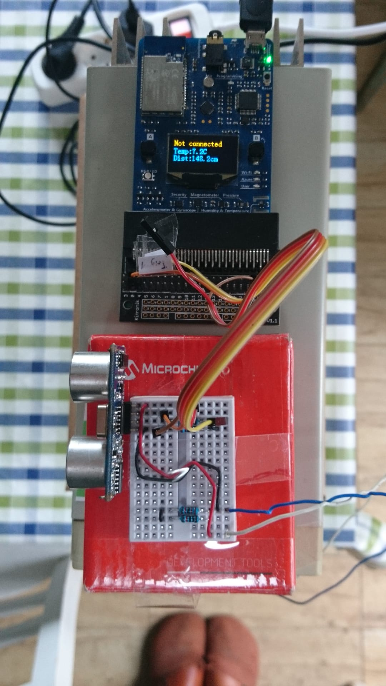
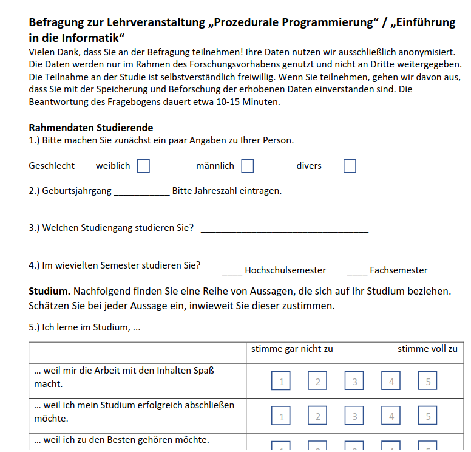

<!--

author:   Sebastian Zug & André Dietrich & Galina Rudolf
email:    sebastian.zug@informatik.tu-freiberg.de & andre.dietrich@ovgu.de & Galina.Rudolf@informatik.tu-freiberg.de
version:  1.0.5
language: de
narrator: Deutsch Female

comment: Einführung in die Programmierung für Nicht-Informatiker
logo: ./img/LogoCodeExample.png

import: https://github.com/liascript/CodeRunner

-->

[](https://liascript.github.io/course/?https://github.com/TUBAF-IfI-LiaScript/VL_ProzeduraleProgrammierung/blob/master/12_Anwendungen.md)

# Finale Anwendung und Ausblick

| Parameter                | Kursinformationen                                                                                                                                                                              |
|--------------------------|------------------------------------------------------------------------------------------------------------------------------------------------------------------------------------------------|
| **Veranstaltung:**       | `Prozedurale Programmierung / Einführung in die Informatik`                                                                                                                                    |
| **Semester**             | `Wintersemester 2022/23`                                                                                                                                                                       |
| **Hochschule:**          | `Technische Universität Freiberg`                                                                                                                                                              |
| **Inhalte:**             | `Anwendungen der Datenerhebung und Analyse`                                                                                                                                                    |
| **Link auf Repository:** | [https://github.com/TUBAF-IfI-LiaScript/VL_ProzeduraleProgrammierung/blob/master/12_Anwendungen.md](https://github.com/TUBAF-IfI-LiaScript/VL_ProzeduraleProgrammierung/blob/master/12_Anwendungen.md) |
| **Autoren**              | @author                                                                                                                                                                                        |


--------------------------------------------------------------------


**Organisatorisches**

Konsultationsangebote der Tutoren und Mitarbeiter ()

* Mittwoch, 8.02.2023, 17:45 (Rammler Bau)
* weitere Termine nach Abstimmung in den Übungsgruppen sowie im Übungsordner im Git

---------------------------------------------------------------------

**Fragen an die heutige Veranstaltung ...**

* In welche strukturellen Einheiten lässt sich die Verarbeitungskette ?

---------------------------------------------------------------------

## Anwendung

Mit Blick auf die Sensoren haben wir darüber gesprochen, dass die Distanzmessung von Ultraschallsensoren von der Temperatur abhängt.

Wir wollen dies mit einer sehr einfachen Messkampange bestätigen. Dazu wurde ein [HC-SR04](https://www.mikrocontroller.net/attachment/218122/HC-SR04_ultraschallmodul_beschreibung_3.pdf) Ultraschallsensor in einem ungeheizten Gebäude auf eine Wand gerichtet. Die Distanz zur Wand betrug $1.45m$





### Datenerhebung

Der Messaufbau wurde über 3 Wochen im Januar 2023 betrieben. Die gesammelten Daten wurden über ein WLAN-Kommunikation mit der Webseite [https://thingspeak.com/](https://thingspeak.com/) abgelegt. Der zugehörige Code findet sich im [Projektrepository](https://github.com/TUBAF-IfI-LiaScript/VL_ProzeduraleProgrammierung/tree/master/examples/12_Anwendungen/Datenerhebung).


https://thingspeak.com/channels/1998194


### Datenfilterung

Über den Export von Thinkspeak wurde das gesamten Datenset als CSV-Datei exportiert. 

```
created_at,entry_id,field1,field2,field3,latitude,longitude,elevation,status
2023-01-06T16:44:16+00:00,1,12.600000,69.699997,8512.000000,,,,
2023-01-06T16:44:36+00:00,2,12.600000,69.800003,8610.000000,,,,
2023-01-06T16:44:57+00:00,3,12.400000,69.800003,8365.000000,,,,
2023-01-06T16:45:17+00:00,4,12.400000,70.000000,8536.000000,,,,
```

Folgende Adaptionen waren notwendig:

+ Wie im [Programmcode](https://github.com/TUBAF-IfI-LiaScript/VL_ProzeduraleProgrammierung/blob/master/examples/12_Anwendungen/Datenerhebung/UltraSonicToThinkspeak.ino) sichtbar, wurde alle 20s eine Messung erhoben. Diese zeitliche Auflösung ist für die weitere Verwendung (die Daten werden bei jedem Start der Analysen von Github geladen) zu hoch.  
+ Die Spaltenköpfe treffen keine Aussage zu zur Bedeutung der Messwerte - hier sollten aussägekräftige Spaltenbezeichner vewendet werden.

Für die Realisierung wurde in Python-Skript verwendet

```python
import pandas as pd

df=pd.read_csv("distanceMeasurements.csv", sep=',', header = 0)
# Löschen der irrelevanten Spalten aus dem Datensatz
df.drop(['entry_id', 'latitude', 'longitude', 'elevation', 'status'], axis=1, inplace=True)
# Entfernen aller Messungen mit geradem Index 
df_filtered = df[df.reset_index().index % 2 != 0]  .copy()
df_filtered.head(5)

df_filtered.reset_index(drop=True, inplace = True)
# Umbenennen der Spaltennamen
df_filtered.rename(columns = {'field1':'Temperature', 
                              'field2':'Humidity',
                              'field3':'US_duration'}, inplace = True)
df_filtered.head(5)

# Speichern als neue csv Datei
df_filtered.to_csv("distanceMeasurements_filtered.csv", index= False)
```

### Datenanalyse

                           {{0-1}}
******************************************************************************

__Fragekomplex 1:__ Welche Temperaturentwicklung konnte beobachtet werden?

<!-- --{{0}}-- Idee des Codefragments:
  # Identifikation der Ausnahmesituationen 
  df['Temperature_diff']= (df["Temperature"].diff().abs() > 0.4) * 1
  # Erweiterung der Darstellung
  ax = df.plot(x="date", y="Temperature")
  df.plot(x="date", y="Temperature_diff", ax = ax)
-->
```python evaluateDataSet.py
import pandas as pd
import matplotlib.pyplot as plt

url="https://raw.githubusercontent.com/TUBAF-IfI-LiaScript/"+ \
    "VL_ProzeduraleProgrammierung/master/examples/"+ \
    "12_Anwendungen/US_experiment/Datenset/"+ \
    "distanceMeasurements_filtered.csv"

df=pd.read_csv(url, sep=',', header = 0)  
# Einfügen einer "echten" Zeitspalte
df['date'] = pd.to_datetime(df['created_at']) 
print(df.head(3))

df.plot(x="date", y="Temperature")

#plt.show()  
plt.savefig('foo.png') # notwendig für die Ausgabe in LiaScript
```
@LIA.eval(`["main.py"]`, `none`, `python3 main.py`)

> Welche Spitzenwerte in Bezug auf die Temperatur wurden erreicht?
> Zu welchen Zeitpunkten traten diese auf?

******************************************************************************


                           {{1-2}}
******************************************************************************

__Fragekomplex 2:__ Welche Auswirkung hatte dies für die die Distanzmessung?

Die Schallgeschwindigkeit lässt sich nach der Gleichung 

$$v_{schall} (m/s) = 331.3 + (0.606 \cdot T)$$

abschätzen. Dabei ist zu beachten, dass die Zeitmessung in $ns$ erfolgte. Im Ergebnis wollen wir aber eine Ausgabe in $cm$ realisieren.

<!-- --{{0}}-- Idee des Codefragments:
  # Erklärung der Berechnung der Schallgeschwindigkeit/Distanz 
  # Ausgabe der Parameter mit .describe 
  # Histogrammdarstellung mit 
  df["US_distance"].plot.hist(bins=25)
-->
```python evaluateDataSet.py
import pandas as pd

url="https://raw.githubusercontent.com/TUBAF-IfI-LiaScript/"+ \
    "VL_ProzeduraleProgrammierung/master/examples/"+ \
    "12_Anwendungen/US_experiment/Datenset/"+ \
    "distanceMeasurements_filtered.csv"

df=pd.read_csv(url, sep=',', header = 0)  
df["US_speed"] = (331.3 + (0.606 * df["Temperature"])) / 1000 / 1000 * 100
df["US_distance"] = df["US_duration"]*df["US_speed"] / 2
print(df.head(3))
```
@LIA.eval(`["main.py"]`, `none`, `python3 main.py`)

******************************************************************************

## Ausblick

Ein Blick zurück in den Oktober ... mit welchen Zielen/ Motivation waren wir gestartet:

<!-- style="background-color: rgba(255, 255, 0, 0.5);"-->
> Vorlesung I - 25.10.2022
>
> + __Anwendungssicht__
> 
>   _Wir möchten Sie in die Lage versetzen einfache Messaufgaben mit einem Mikrocontroller zu realisieren und die Daten auszuwerten._
> 
> + __Algorithmische Perspektive__
> 
>   _Wir möchten Sie dazu ertüchtigen den Algorithmusbegriff der Informatik zu durchdringen und anwenden zu können._
> 
> + __Konzeptionelle Perspektive__
> 
>   _Sie erlernen grundlegende Elemente der prozeduralen und der objektorientierten Programmierung._
> 
> + __Umsetzungssicht__
> 
>   _Wir vermitteln Grundkenntnisse in den Programmiersprachen C++ und Python._

### Exkurs

Bislang programmieren wir unsere Anwendungen in einem klassischen Format. Wir schreiben den Code in eine Datei und führen diesen mit einem Mausklick in der Entwicklungsumgebung oder einem Aufruf im Terminal aus.

Insbesondere im Bereich der Datenverarbeitung und der künstlichen Intelligenz sind aber auch die Verwendung von Notebooks etabliert. Jupyter Notebook (früher IPython Notebooks) ist eine web-basierte interaktive Umgebung, mit der Jupyter-Notebook-Dokumente erstellt werden können. Dabei wird der Code in Blöcken aufgeteilt - die unabhänig von einander ausgeführt werden können. Ergänzt werden diese durch Kommentarblöcke, die wiederum in Markdown geschrieben werden können. 

!?[](https://www.youtube.com/watch?v=uFzrYiwnKEk&t=186s)

> Achtung: Notebooks erlauben einen schnellen Einstieg in die Arbeit und eine gute Kommentierung der Codeblöcke, sind aber aus dem Blick des Entwicklungsprozesses kritisch zu sehen:
>
> + Ausgabe und Code verschmelzen in einem Dokument. Dies macht die Nachvollziehbarkeit von Änderungen am Code aufwändig.
> + Die beliebige Reihung der Ausführung während der Entwicklung führt dazu, dass Notebooks häufig nicht intuitiv von oben nach unten ausführbar sind.
> + Notebooks selbst eignen sich nicht, um Code zu modularisieren.

### Zusammenfassung 

Was konnten / wollten wir dabei nicht leisten:

+ Der Softwareentwicklungsprozess ist völlig unberücksichtigt geblieben.
+ Sie haben die Programmiersprachen C++ und Python nur in den Grundkonzepten kennen gelernt.
+ Die unterschiedlichen Programmiertechniken von C++ für  Mikrocontroller und Desktopanwendungen wurden nicht berührt.
+ ...

> Wenn Sie Lust auf mehr "Software" haben, bietet die Veranstaltung _Softwareentwicklung_ im kommenden Semester einen guten Ansatzpunkt!

## Klausurvorbereitung

Gehen Sie bitte von folgenden Aufgabentypen für die Klausur aus:

+ Korrektur eines Programmes: _Finden Sie Fehler im nachfolgenden Codebeispiel ..._
+ Entwerfen eines Programmes / Ergänzen von Methoden: _Erweitern Sie den Code um eine Methode XY ..._ 
+ Analyse eines Programmes: _Welchen Wert gibt das Programm mit dem Erreichen der Zeile N aus?_
+ Konzeptionelle Fragen: _Nennen Sie drei Ganzzahldatentypen in C++._

### A1: Korrektur eines Programms

_Für die Auswertung der Messergebnisse wird eine Funktion benötigt, die den größten Wert und seine Position in einem Array ermittelt. Es kann dabei davon ausgegangen werden, dass der Wert im Array nur einmal vorkommt._
_Die vorliegende Implementierung der Funktion sowie die dazugehörige main-Funktion enthalten syntaktische und logische Fehler, die es zu korrigieren gilt:_
_Schreiben Sie das korrigierte Programm auf._

```cpp                     Aufgabe1.cpp
#include <iostream>

int maximum(double values,double& max_value)
{
  for (i=0;i<anz;i++)
  {
    &max_value=values[0];
    if (values[i]<max_value)
    {
      value[i]=&max_value;
      i=pos;
    }
  }
  return pos;
}

int main(void)
{
  double werte[100];max;
  int I;
  for (i=0;i<100,i++) cin<<werte[i];
  std::cout<<"Position: <<maximum(werte,100,max)>>"\n";
  std::cout<<"Maximum: ",<<max
  return 0;
}
```
@LIA.eval(`["main.cpp"]`, `g++ -Wall main.cpp -o a.out`, `./a.out`)

> Machen Sie sich bewusst, dass Sie in der Klausur keine Möglichkeit haben, den Compiler "zu befragen". Üben Sie daher das lesen von Code. Tauschen Sie dazu Programme aus den Übungen untereinander aus und evaluieren Sie diesen.

### A2: Erweitern eines C++-Programms

_Die Klasse Akte enthält als Datenfelder die Angaben zum Aktenzeichen und der Laufzeit:_

```cpp          Aufgabe2.cpp
class Akte
{
  private:
  std::string aktenzeichen;
  int laufzeit;
};
```
@LIA.eval(`["main.cpp"]`, `g++ -Wall main.cpp -o a.out`, `./a.out`)

_Eine weitere von der Klasse `Akte` abgeleitete Klasse `AkteX` soll neben den bereits in der Klasse `Akte` enthaltenen Angaben einen Aktencode (eine dreistellige ganze Zahl) enthalten._
_Definieren Sie die Klasse `AkteX` und vervollständigen Sie die Klasse `Akte` um die Member, die folgende Anweisungen in der main-Funktion ermöglichen würden:_

```cpp
int main() {
  Akte akte1("08-15",2),
  akte2;
  std::cout << "Voraussichtliche Laufzeit: "<<akte1.getLaufzeit()<<"\n";
  akte1.setLaufzeit(4);
  akte2.ausgabe();
  AkteX aktex("08-16",99,816);
  aktex.ausgabe();
  std::cout <<aktex.getAktencode()<<"\n";
}
```

+ _Die Funktion `ausgabe()` beider Klassen soll alle in einem Objekt gespeicherten Angaben auf dem Standard-Output ausgeben. 
+ In der Klasse `AkteX` sollen allerdings sowohl die Funktion `ausgabe` als auch die Funktion `getAktencode` statt des gespeicherten Wertes dessen Quersumme ausgeben bzw. liefern._
+ _Hinweis: bei den Objekten der Klasse `sdt:string` ist (anders als bei `char[]`) die Zuweisung mit `=Operator` möglich._

### A3: Kurze Fragestellungen

1. Markieren Sie alle Ganzzahldatentypen in folgender Aufstellung.

   - [( )] std:string
   - [(X)] short
   - [( )] float
   - [( )] bool

2. Welchen Inhalt gibt das folgenden Codefragment aus?

   ```cpp
   char text [] = "Dieser lange Text ergibt keinen Sinn";
   for (int i=0;i<4;i=i+2) std::cout<<text[i];
   std::cout<<text[5];
   ```
   
   [[Der]]

3. Schreiben Sie den Code in 2) als Python code.

   ```python
   text = "Dieser lange Text ergibt keinen Sinn"
   
   ```
   @LIA.eval(`["main.py"]`, `none`, `python3 main.py`)

4. Welches Konzept nutzt C++ um die Member einer Klasse vor dem Zugriff aus der anderen Klassen zu schützen.

   [[Kapselung]]

5. Mit Hilfe welcher Methoden werden C++-Objekte erstellt?

   - [( )] Destruktoren
   - [(X)] Konstruktoren
   - [( )] private Methoden
   - [( )] `new`

## Fragebögen

Für die Analyse des Erfolgs der Lehrveranstaltung bitten wir Sie um Ihr Feedback. Der gleich Fragebogen wurde bereit 2019 genutzt, um die Erwartungen und die Motivation der Studierenden mit dem Erreichten in Relation zu setzen.



> Vielen Dank für Ihre Mitarbeit am Fragebogen!

> Vielen Dank für Ihre Beteiligung während der Übungen und der Vorlesungen!
